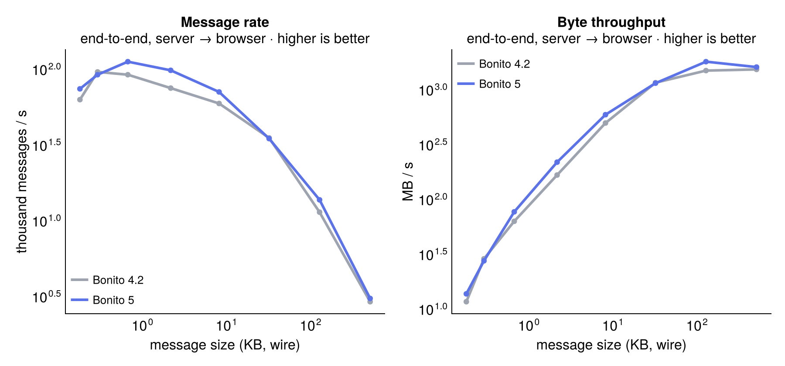
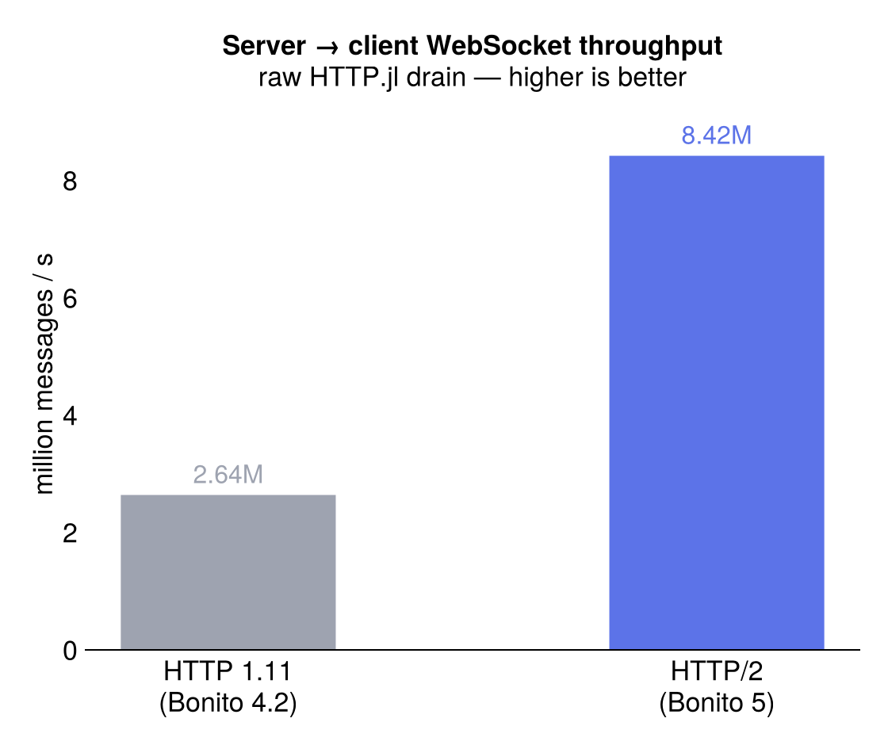
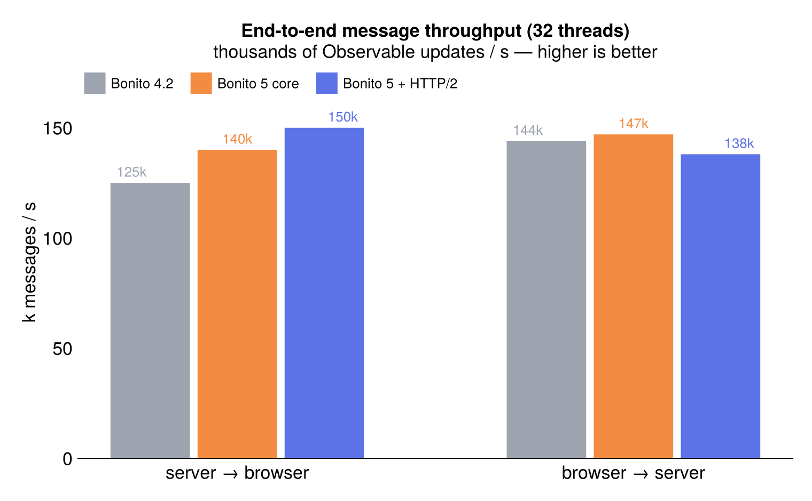
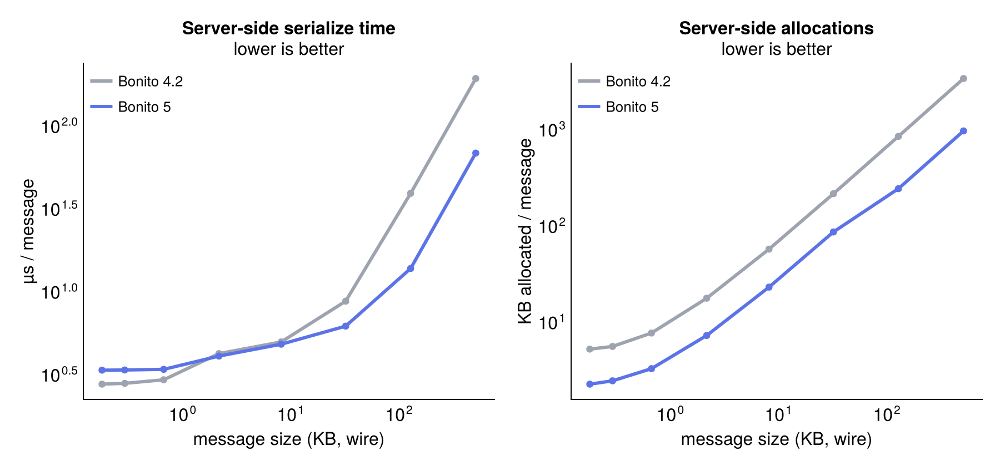
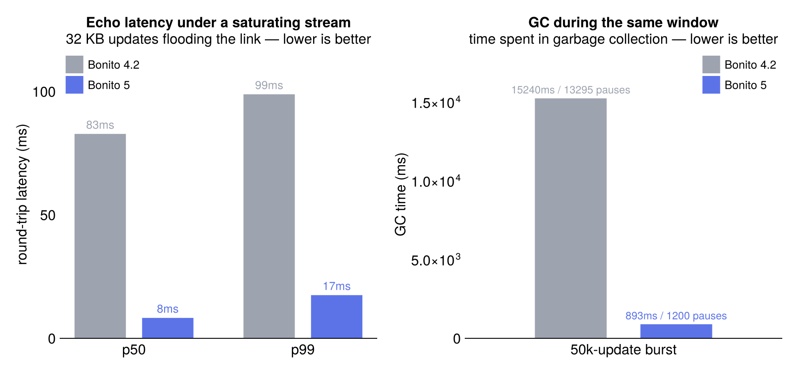
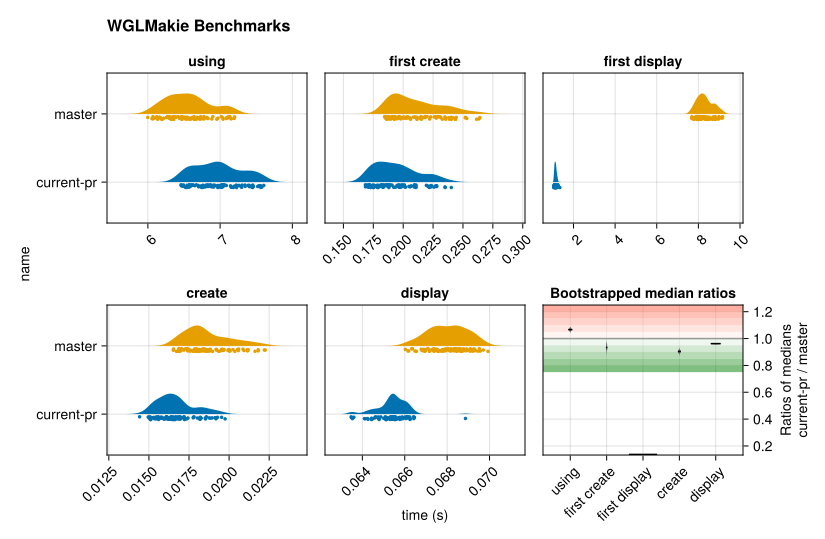

# Bonito 5.0

Bonito 5 is the biggest release since the package was renamed from JSServe. Most of the work went into networking, session handling, asset serving and serialization, and the result is that talking to the browser got a lot faster and a lot more stable.

There's also a new documentation system (the one you're reading), a companion widget package, dark-mode-aware widgets, remote apps, and a long list of bug fixes and lifecycle cleanups.

## Performance

First, we put quite some work into performance.
Part of it was upgrading to HTTP@2, but also rework the serialization protocol and removing allocations where we could.

A Bonito app sends two kinds of traffic: many tiny updates (a slider drag or a click, a few hundred bytes) and fewer large ones (a plot or data view, tens to hundreds of kilobytes). Small messages are limited by message rate, large ones by serialization speed.



Bonito 5 is ahead of 4.2 across the whole range, and the two big pieces of work behind that land on opposite ends of the curve: the transport for small messages, serialization for large ones.

Small, frequent updates are limited by the WebSocket transport, which is what the HTTP/2 move buys. On the raw HTTP.jl layer, draining messages from server to client went from 2.64M to 8.42M per second once the read path stopped copying and reallocating, roughly a 3× jump:



That took some care at Bonito's default of 32 threads, where a naive HTTP/2 port regressed the receive path badly: a ~30µs round-trip crept into the hundreds of microseconds because the WebSocket reader kept waking on a cold worker. Pinning the reader to its home thread ([Reseau #112](https://github.com/JuliaServices/Reseau.jl/pull/112), [HTTP.jl #1268](https://github.com/JuliaWeb/HTTP.jl/pull/1268)) and dropping a 64KB-per-frame allocation (also #1268) brought latency back flat across thread counts, within a couple of microseconds of HTTP 1.11.

Through the full protocol those updates come out about 20% faster end to end than 4.2: the session rework alone takes server-to-browser throughput from 125k to 140k Observable updates a second, and HTTP/2 brings it to 150k. Browser-to-server stays around 140k.



Large payloads are limited by serialization instead, where the session rework, a reusable per-session pack buffer (`SessionIO`), and the upstream [MsgPack.jl](https://github.com/JuliaIO/MsgPack.jl/pull/69) changes pay off:



The two builds are even at a few hundred bytes, but by a quarter-megabyte plot update Bonito 5 serializes about 2.8× faster and allocates about 3.5× less — under 2× the message size in temporaries, where 4.2 churned through 6×. (MsgPack writes multi-byte values without boxing them in a `Ref`, takes a `sizehint`, and has a leaner `unpack`.)

Those temporaries matter even with CPU to spare, because they turn into GC pauses and latency spikes. Streaming 32KB updates as fast as the link allows, a single echo round-trip on 4.2 stalls behind 15 seconds of GC at a p50 of 83ms; Bonito 5 spends under a second in GC and holds 8ms.



(Numbers are from Julia 1.12.6 with an ElectronCall client driving a `Bonito.Server` at 32 threads, medians over repeated runs, give or take 10% between runs. The longer write-up, including the approaches that didn't pan out, is in the perf notes.)

## The documentation system

You're looking at it. This whole site, the landing page, the sidebar, search, the version switcher and this blog, is rendered by Bonito, with a VitePress-style theme and proper light and dark modes.

It's a Documenter plugin, so there's no second static-site generator to learn and no Node build step. You write normal Documenter markdown like before, and switching the theme on is one line in your `make.jl`:

```julia
using Documenter, Bonito

makedocs(
    sitename = "MyPackage",
    format = Bonito.DocumenterBonito(),
    # ...
)
```

The landing page and the blog are extra keyword arguments on the same plugin: give it a `home` config and a `blog` folder and you get the hero, the post index and an RSS feed. And since it's Bonito underneath, the examples are interactive but exported to static HTML, so the widgets and plots in the docs keep working without a Julia process behind them.

The blog is still experimental, the build and Julia integration have rough edges, and the plan is to improve [BonitoSites](https://github.com/SimonDanisch/BonitoSites.jl) and get the best from the build caching, for efficiently building blogposts with many Julia code blocks and heavy dependencies.

## BonitoWidgets

[BonitoWidgets.jl](https://github.com/SimonDanisch/BonitoWidgets.jl) is a new companion package with the layout pieces you end up needing once an app grows: tabs, resizable splits, collapsibles, floating windows, and a VSCode-style `Workspace` (a tree of splits whose leaves are tab groups). It grew out of the layout code in BonitoBook and a couple of not yet published apps.


The important part here is that the content stays alive. Panels are mounted once and only re-flowed with CSS, so switching a tab or flipping a split never re-renders the children, and a WGLMakie figure keeps its WebGL context and camera through any layout change. All the layout state (active tab, split fraction, orientation, window position) is an Observable you can read and set from Julia, dragging works with both mouse and touch, and everything themes through `--bw-*` CSS variables with light/dark defaults.

## Dark-mode-aware widgets

The built-in widgets (buttons, sliders, dropdowns, tables, range sliders) now read a handful of `--bonito-widget-*` CSS variables and ship a default mapping based on `prefers-color-scheme`. A standalone app follows the OS light/dark setting on its own now, and a page that wants its own look (like these docs) can restyle every widget by setting those variables.

## Remote apps

Bonito 5 can drive an app that runs in one Julia process from another one. That's handy on its own, but mostly it's a teaser: it's the groundwork for running [BonitoBook](https://bonitobook.org) notebooks against remote workers, so the heavy compute can live somewhere other than the process serving the UI. More on that later.

## Under the hood

A lot of this release is plumbing you'll mostly notice as fewer bugs and less jank:

- `Session` was split into a `RootSession` and per-render sub-sessions, and `SubConnection` is gone. Object and asset lifetimes are handled with proper reference counting now (no more finalizers running inside locks), which closed a bunch of connect/close races.
- The HTTP asset server learned range requests for media, `Cache-Control` headers, automatic registration of interpolated ES6 modules, and it now tells the precompiler about the source and bundle files it depends on.
- A new `KeyedList` for keyed list rendering, and reactive wrappers that no longer break `flex`/`grid` layout when you put an Observable in the middle of one.
- Terminal output handles ANSI escapes and renders markdown through CommonMark.
- App rendering has a single error boundary: render and init errors get caught and shown through the reconnect indicator's `error[]` observable and a minimal error page, instead of taking down the session.
- Various reconnect deadlocks, stale-error reconnects and thread-safety races are fixed, and `isready` no longer closes sessions or blocks sends on you.
- `port:0` works, `proxy_url` got some fixes, and the JS is rebundled.
- Lots of new tests came with all of this: error handling, a race-condition audit, protocol round-trips, static export, CommonMark and cache lifetime.

## Tooling and compile time

Testing and display now run on [ElectronCall](https://github.com/IanButterworth/ElectronCall.jl), and the old Electron backend still works too. There's a small testing layer on top of it that drives real browser input for end-to-end tests; it's what runs the interactive tests in this repo, though it's still settling in and not released yet.

Compile time and time-to-first-plot have also been getting attention, including some unreleased WGLMakie changes that pair with this release ([Makie #5584](https://github.com/MakieOrg/Makie.jl/pull/5584)). The MsgPack `unpack` cleanup above is part of that, and so is [HTTP.jl #1296](https://github.com/JuliaWeb/HTTP.jl/pull/1296), which removes a batch of `write` invalidations.



It's an ongoing effort and should keep getting better.

## Thanks

A big chunk of this work was funded by [ReynKo](https://reynko.com/), thank you for making all these improvements possible.
