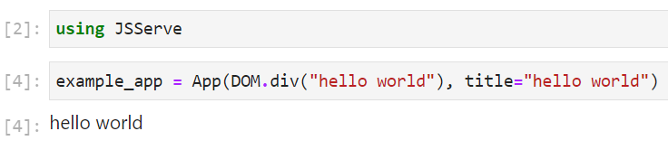
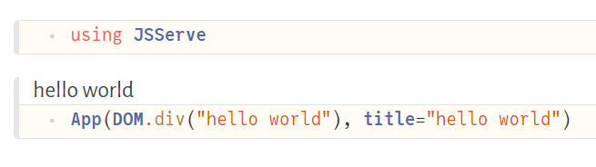

# Deployment

```@example 1
using Dashi
example_app = App(DOM.div("hello world"), title="hello world")
```

## Server

```@example 1
# Depending on your servers setup, you may need to listen on another port or URL
# But 0.0.0.0:80 is pretty standard for most server setups
port = 80
url = "0.0.0.0"
server = Dashi.Server(example_app, url, port)
nothing
```

Now, you should see the webpage at `http://0.0.0.0:80`.

### Proxy + Julia Hub

If the server is behind a proxy, you can set the proxy like this:

```@example 1
server = Dashi.Server(example_app, url, 8080; proxy_url="https://my-domain.de/my-app");
# or set it later
# this can be handy for interactive use cases where one isn't sure which port is open, and let Dashi find a free port (which will then be different from the one created with, but is stored in `server.port`)
server.proxy_url = ".../$(server.port)"
```

Dashi tries to do this for known environments like JuliaHub via `get_server()`.
This will find the most common proxy setup and return a started server:

```@example 1
server = Dashi.get_server()
# add a route to the server for root to point to our example app
route!(server, "/" => example_app)
```
The url which this site is now served on can be found via:

```@example 1
# Here in documenter, this will just return a localhost url
url_to_visit = online_url(server, "/")
```

Like this, one can also add multiple pages:
```@example 1
page_404 = App() do session, request
    return DOM.div("no page for $(request.target)")
end
# You can use string (paths), or a regex
route!(server, r".*" => page_404)
route!(server, r"my/nested/page" => App(DOM.div("nested")))
url_to_visit = online_url(server, "/my/nested/page")
```

### Heroku

Deploying to Heroku with Dashi works pretty similar to this [blogpost](https://towardsdatascience.com/deploying-julia-projects-on-heroku-com-eb8da5248134).

```
mkdir my-app
cd my-app
julia --project=. -e 'using Pkg; Pkg.add("Dashi")' # and any other dependency
```

then create 2 files:

`app.jl`:
```julia
using Dashi
# The app you want to serve
#  Note: you can also add more pages with `route!(server, ...)` as explained aboce
my_app = App(DOM.div("hello world"))
port = parse(Int, ENV["PORT"])
# needs to match `heroku create - a example-app`,
# which we can ensure by using the env variable
# which is only available in review app, so one needs to fill this in manually for now
# https://devcenter.heroku.com/articles/github-integration-review-apps#injected-environment-variables
my_app_name = get(ENV, "HEROKU_APP_NAME", "example-app")
url = "https://$(my_app_name).herokuapp.com/"
wait(Dashi.Server(my_app, "0.0.0.0", port, proxy_url=url))
```
`Procfile`:
```
web: julia --project=. app.jl
```

and then to upload the app install the [heroku-cli](https://devcenter.heroku.com/articles/heroku-cli) and run as explained in the [heroku git deploy section](https://devcenter.heroku.com/articles/git):

```
$ cd my-app
$ git init
$ git add .
$ git commit -m "first commit"
$ heroku create -a example-app
$ heroku git:remote -a example-app
```
Which, after showing you the install logs, should print out the url to visit in the end.
You can see the full example here:

https://github.com/SimonDanisch/Dashi-heroku

## Terminal
If no HTML display is found in the Julia display stack, Dashi calls `Dashi.enable_browser_display()` in the `__init__` function.
This adds a display, that opens a browser window to display the app
The loading of the `BrowserDisplay` happen in any kind of environment without html display, so this should also work in any kind of terminal or when evaluating a script.

```julia
> using JSSever
> example_app # just let the display system display it in a browser window
```

## VScode

VScode with enabled `Plot Pane` will display any `Dashi.App` in the HTML plotpane:


## Notebooks

Most common notebook systems should work out of the box.

### IJulia


### Jupyterlab


### Pluto


## Electron

```julia
using Electron, Dashi
# Needs to be called after loading Electron
Dashi.use_electron_display()
# display(...) can be skipped in e.g. VSCode with disabled plotpane
display(example_app)
```


## Documenter

Dashi works in Documenter without additional setup.
But, one always needs to include a block like this before any other code block displaying Dashi Apps:

```julia
using Dashi
Page()
```
This is needed, since Dashi structures the dependencies and state per Page, which needs to be unique per documentation page.
One can use the Dashi documentation source to see an example.

## Static export


## Anything else

Dashi overloads the `display`/`show` stack for the mime `"text/html"` so any other Software which is able to display html in Julia should work with Dashi.
If a use case is not supported, please open an issue.
One can also always directly call:
```julia
html_source = sprint(io-> show(io, MIME"text/html"(), example_app))
```
Do get the html source code as a string (or just write it to the io).
